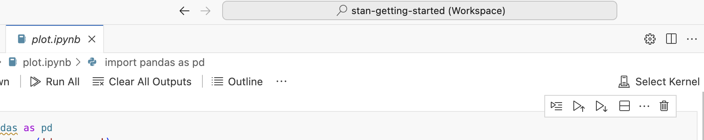
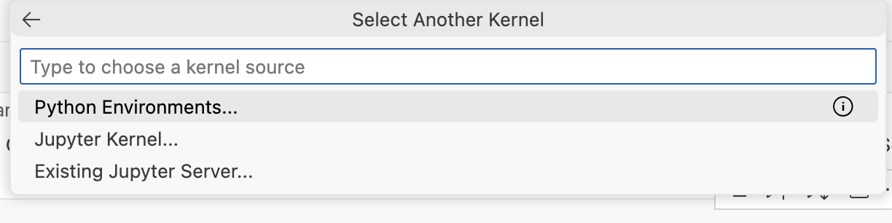
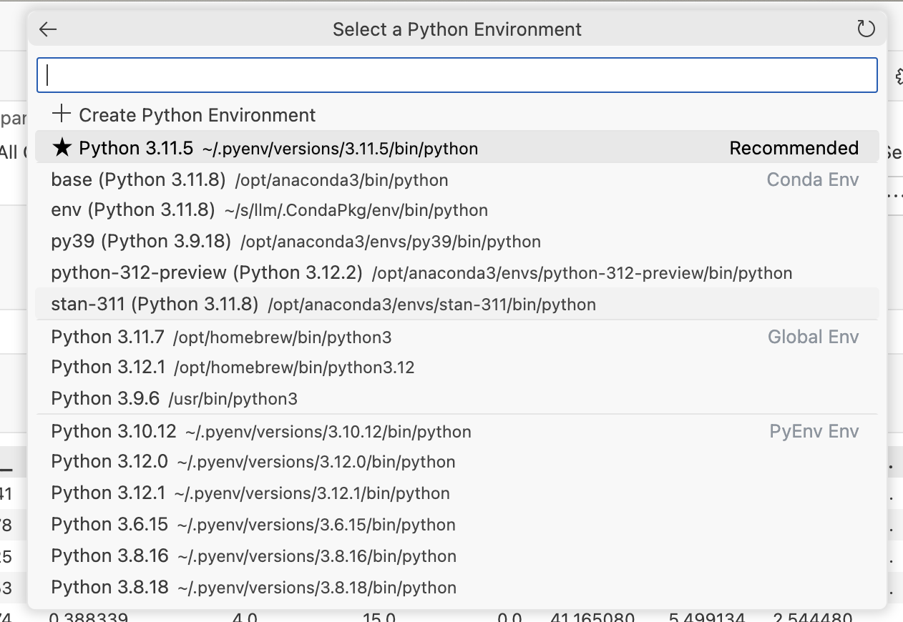
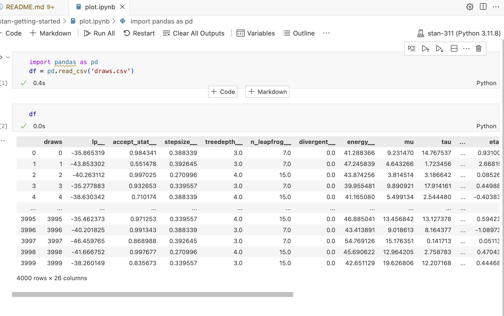

# stan getting started 

This is Stan getting started for my daughter studying her freshman's Theoretical Physics 

This works on M2 Macbook Air , Xcode , command line tools installed , and latest Anaconda 

```bash
conda create -n stan-311 python=3.11 && \
conda activate stan-311 && \
python3 -m pip install poetry
```

```bash
git clone --depth=1 git@github.com:stan-dev/httpstan.git && \
cd httpstan && \
make && \
python3 -m poetry build && \
python3 -m pip install dist/*.whl
```

```bash
cd && \
git clone --depth=1 git@github.com:stan-dev/pystan.git && \
cd pystan && \
pip install .
```

and ignore crashtest error 

```bash
pip install pandas 
```

# how to run stan program 

then

```bash
cd to/here/ && \
conda activate stan-311 && \

```

and run 

```bash
$ python schools.py 
Building: found in cache, done.
Messages from stanc:
Warning: The parameter tau has no priors. This means either no prior is
    provided, or the prior(s) depend on data variables. In the later case,
    this may be a false positive.
Warning: The parameter mu has no priors. This means either no prior is
    provided, or the prior(s) depend on data variables. In the later case,
    this may be a false positive.
Sampling: 100% (8000/8000), done.
Messages received during sampling:
  Gradient evaluation took 0.000101 seconds
  1000 transitions using 10 leapfrog steps per transition would take 1.01 seconds.
  Adjust your expectations accordingly!
  Gradient evaluation took 1e-05 seconds
  1000 transitions using 10 leapfrog steps per transition would take 0.1 seconds.
  Adjust your expectations accordingly!
  Gradient evaluation took 8e-06 seconds
  1000 transitions using 10 leapfrog steps per transition would take 0.08 seconds.
  Adjust your expectations accordingly!
  Gradient evaluation took 8e-06 seconds
  1000 transitions using 10 leapfrog steps per transition would take 0.08 seconds.
  Adjust your expectations accordingly!
```

now go and analyse 

# analyse results , plotting etc 

open VScode 

open [plot.ipynb](./plot.ipynb) from here 

and select kernel (=conda environment from the first step) like this 







then if you click Run All you should get this output 

