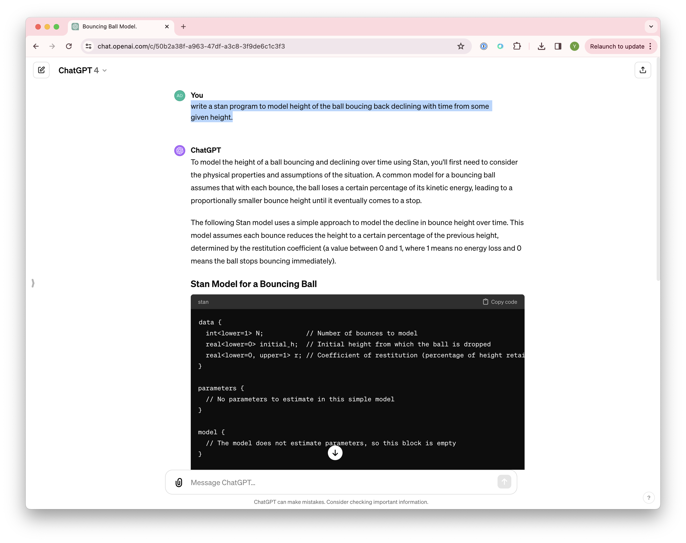
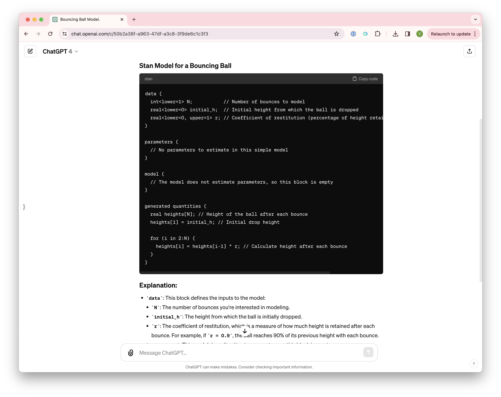
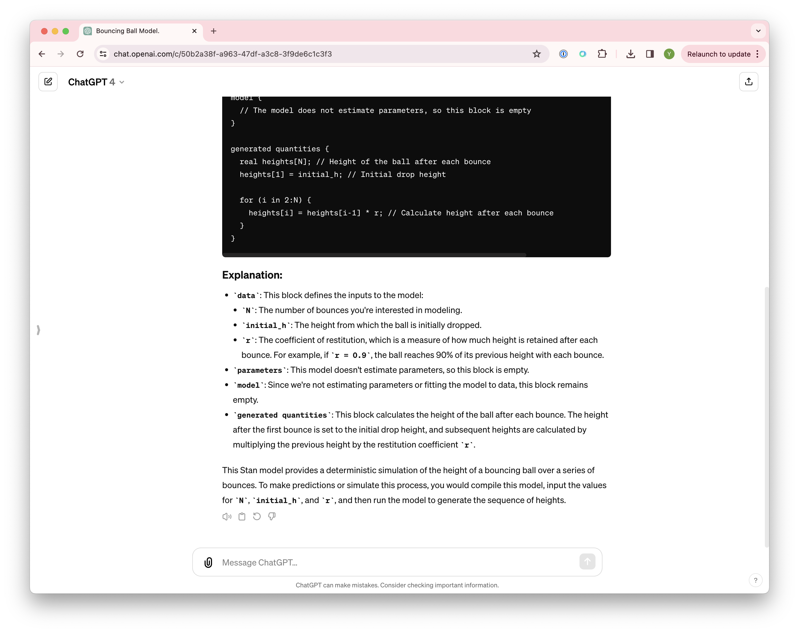

# stan getting started 

This is Stan getting started for my daughter studying her freshman's Theoretical Physics. Get everything below in [install everything](#install-everything)

Lets use ChatGPT to write our first program for this: write a stan program to model height of the ball boucing back declining with time from some given height.







here's verbatim output from ChatGPT

```stan
data {
  int<lower=1> N;           // Number of bounces to model
  real<lower=0> initial_h;  // Initial height from which the ball is dropped
  real<lower=0, upper=1> r; // Coefficient of restitution (percentage of height retained after each bounce)
}

parameters {
  // No parameters to estimate in this simple model
}

model {
  // The model does not estimate parameters, so this block is empty
}

generated quantities {
  real heights[N]; // Height of the ball after each bounce
  heights[1] = initial_h; // Initial drop height
  
  for (i in 2:N) {
    heights[i] = heights[i-1] * r; // Calculate height after each bounce
  }
}

```

# run (generated quantities like this)

Run using CmdStan like this h/t https://cmdstanpy.readthedocs.io/en/stable-0.9.65/generate_quantities.html#example-add-posterior-predictive-checks-to-bernoulli-stan

```bash
$ python run.py 
12:53:09 - cmdstanpy - INFO - CmdStan start processing
chain 1 |████████████████████████████████████████████████████████████████████████████████████████████████████████████████| 00:00 Sampling completed
chain 2 |████████████████████████████████████████████████████████████████████████████████████████████████████████████████| 00:00 Sampling completed
chain 3 |████████████████████████████████████████████████████████████████████████████████████████████████████████████████| 00:00 Sampling completed
chain 4 |████████████████████████████████████████████████████████████████████████████████████████████████████████████████| 00:00 Sampling completed
                                                                                                                                                                                                                                                                                                                                                                                                                                                                                                                                                                                                            
12:53:09 - cmdstanpy - INFO - CmdStan done processing.
```

# install everything 

This works on M2 Macbook Air , Xcode , command line tools installed , and latest Anaconda 

```bash
conda create -n stan-311 python=3.11 && \
conda activate stan-311 && \
python3 -m pip install poetry
```

```bash
git clone --depth=1 git@github.com:stan-dev/httpstan.git && \
cd httpstan && \
make && \
python3 -m poetry build && \
python3 -m pip install dist/*.whl
```

```bash
cd && \
git clone --depth=1 git@github.com:stan-dev/pystan.git && \
cd pystan && \
pip install .
```

and ignore crashtest error 

```bash
pip install pandas 
```

then get CmdStan + CmdStanPy like this (this take a while )

```bash
conda activate stan-311 && \
pip install --upgrade cmdstanpy && \
python -c "import cmdstanpy; cmdstanpy.install_cmdstan()" 
```

~~and also build CmdStan + CmdStanPy like this (this takes a while )~~

```bash
conda activate stan-311 && \
pip install --upgrade cmdstanpy && \
cd && \
git clone https://github.com/stan-dev/cmdstan.git --recursive && \
cd cmdstan && \

```

# how to run stan program 

then

```bash
cd to/here/ && \
conda activate stan-311 && \

```

and run 

```bash
$ python schools.py 
Building: found in cache, done.
Messages from stanc:
Warning: The parameter tau has no priors. This means either no prior is
    provided, or the prior(s) depend on data variables. In the later case,
    this may be a false positive.
Warning: The parameter mu has no priors. This means either no prior is
    provided, or the prior(s) depend on data variables. In the later case,
    this may be a false positive.
Sampling: 100% (8000/8000), done.
Messages received during sampling:
  Gradient evaluation took 0.000101 seconds
  1000 transitions using 10 leapfrog steps per transition would take 1.01 seconds.
  Adjust your expectations accordingly!
  Gradient evaluation took 1e-05 seconds
  1000 transitions using 10 leapfrog steps per transition would take 0.1 seconds.
  Adjust your expectations accordingly!
  Gradient evaluation took 8e-06 seconds
  1000 transitions using 10 leapfrog steps per transition would take 0.08 seconds.
  Adjust your expectations accordingly!
  Gradient evaluation took 8e-06 seconds
  1000 transitions using 10 leapfrog steps per transition would take 0.08 seconds.
  Adjust your expectations accordingly!
```

now go and analyse 

# analyse results , plotting etc 

open VScode 

open [plot.ipynb](./plot.ipynb) from here 

and select kernel (=conda environment from the first step) like this 


then if you click Run All you should get this output 

